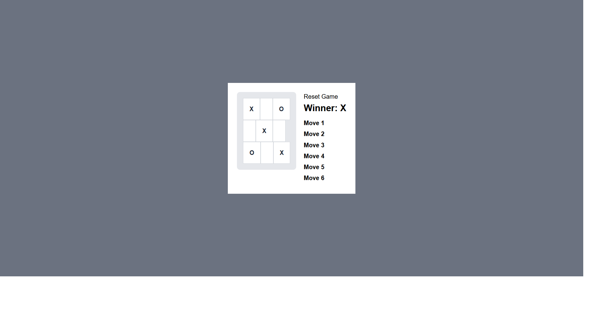

# Tic-Tac-Toe Game

## **Here is the briefly explanation of the tic tac toe game**

*The Tic-Tac-Toe game project is a simple implementation of the classic game using `React` and `Tailwind CSS`. The game allows two players to take turns marking spaces on a `3x3 grid`. The goal is to get three of their own marks (either "X" or "O") in a row, either horizontally, vertically, or diagonally, before the opponent does.*

### **The project consists of multiple components:**

1. **`Game`** Component:  This is the main component that manages the game state, such as keeping track of the game history, current player, and determining the winner. It renders the game board and the status message.

2. **`Board`** Component: This component represents the game board, which is a 3x3 grid of squares. It receives the current state of the squares as props and handles the click event when a square is clicked.

3. **`Square`** Component: This component represents an individual square on the game board. It receives the value ("X", "O", or null) and the onClick event handler from the parent component.

4. **Helper Function:** The `calculateWinner `function is a helper function that checks the game board to determine if there is a winner based on the current state of the squares.

---
The project uses React's component-based architecture to manage the game state and render the UI based on that state. Tailwind CSS is used for styling and layout, providing a responsive and visually appealing design.

---
Overall, the project demonstrates the use of React components, state management, event handling, and basic game logic to create a functional Tic-Tac-Toe game.

